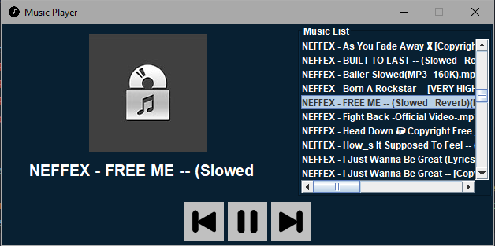

<h1 align="center">Music Player 🎵</h1>

## Description

A Music Player with java.



## Tools

- Jdk 11
- <a href="https://github.com/umjammer/jlayer">Jlayer<a/> library

## How to use

````
# Clone Git Repository
git clone https://github.com/YoruHinda/Music-Player.git
````

````
# Enter Directory
cd musicplayer
````

````
# Run Jar File
java -jar musicplayer.jar
````